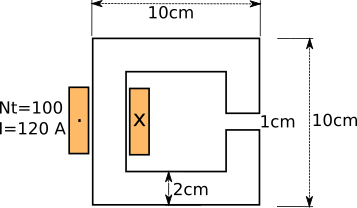
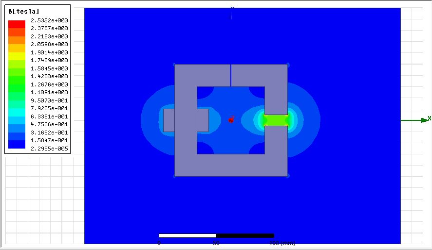
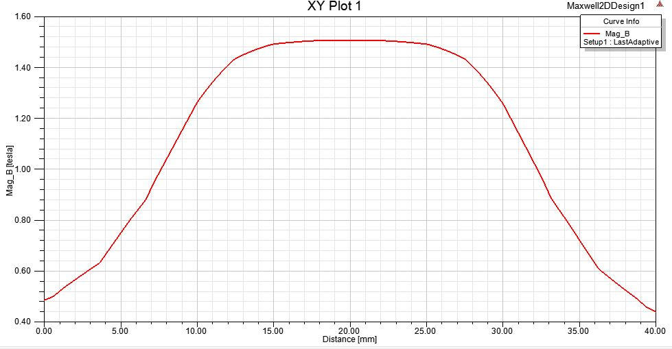
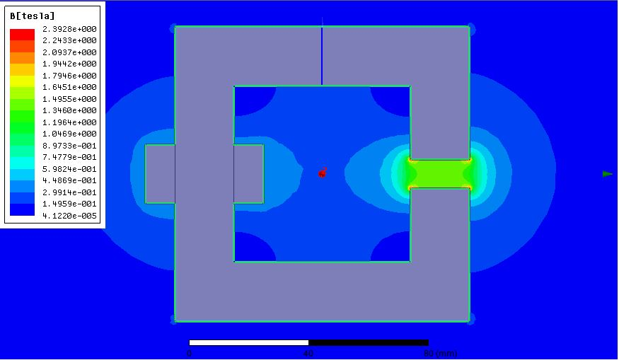
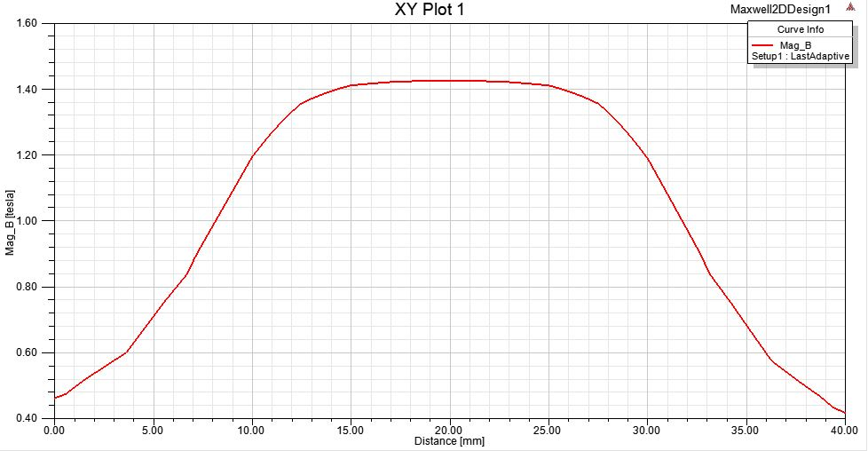
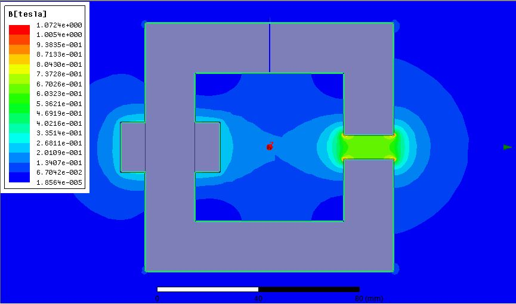
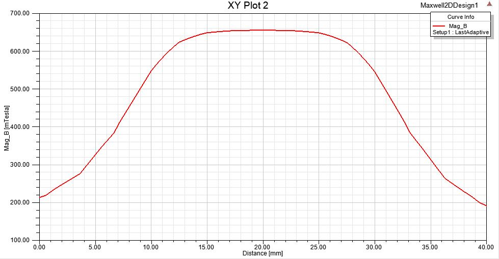
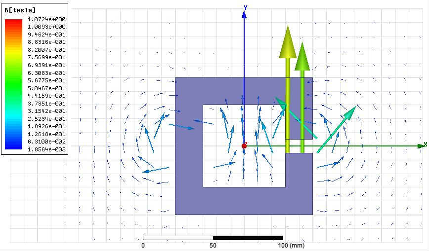

**Objective**  
In this report, flux distribution in a C-core will be investigated in detail. The C-core will firstly examined with analytically. Then, the core will be modelled on a FEA software. The differences between Analytical and Software results will be compared at the end.  

**Properties of the C-core**  

  

**Flux Density in the airgap**

In the first part, infinitely permeable core is assumed. This means that core reluctance will be zero. Hence, there will be no MMF drop on the steel. Therefore:

  

  

**Inductance of the Structure**  
Inductance of the structure is dependent on the turn ratio and the reluctance of the device as shown below. Note that if the core is infinitely permeable, than the total reluctance will be the air gap reluctance. In the inductance calculation, core depth is assumed as 1 meter.

  

  

**Finite Element Analysis of the Infinitely Permeable Core**  
When the core material is selected as simple and having huge relative permeability, air gap flux density is found to be over 1.5T as calculated analytically.

  

  

**Finite Element Analysis with Relative Permeability of 1000**  
When the relative permeability is selected as 1000, maximum flux density in the airgap is found to be below 1.5 T. This is due to the fact that steel reluctance is no longer negligible over the airgap reluctance. Therefore, some of the mmf is dropped on the steel core.
  

  

**Finite Element Analysis with the Given B-H Curve**

  

**Flux Density Distribution Vector**

As it is shown in the figure below, some of the fluxes leaks from the coil and also the core. These fluxes are called **leakage flux**. Moreover, when the flux passes through the airgap, some fluxes do not leave the core perpendicular. This is called **fringing** and fringing can also be observed on the flux density in the airgap. Flux density is not constant in the edges.
  

**Total Flux and Leakage Flux**  

Total flux is calculated in different two side of the structure. One of them is calculated near to coils. It turned out to be 83.5 mWb. The second value is 60 mWb. The difference is related to the leakage fluxes in the structure. Leakage flux is calculated by integration on a line which is drawn from the coil side to the region border.

The inductance of the coil is found to be 69.6 mH near the coil and 50 mH on a away point. These results are higher than the analytical results. Its main reason is the high air gap size. Due to high air gap and fringing flux, the effective airgap area is increasing. Therefore, effective reluctance is decreasing which results in higher inductance value.

Leakage flux is found to be as 10.2 mWb meanwhile leakage inductance is 8.5 mH.  

**Effect of increased current on the inductance**  

| Current(A) | Inductance(mH) |
|------------|----------------|
| 240        | 17.8           |
| 600        | 10.4           |
| 1200       | 7.8            |  

Even though the inductance expression is independent of the current, increasing current causes saturation. Therefore, reluctance of the structure is increasing. Hence, the inductance is decreasing!
