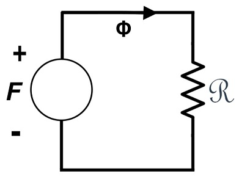
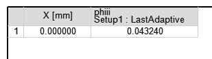

## **Assignment #1**
#### *Göksenin Hande Bayazıt*
---

**1.** Assuming the core is infinitely permeable, the equivalent magnetic circuit of the system becomes

where F = N*I = 120 A\*100 t = 12000 A, airgap reluctance R = 0.01/(A\*u_0) and Phi=B\*A. Therefore airgap flux density can be obtained as: B = N\*I\*u_0 / 0.01 = **1.508 T**.

**2.** L = N^2/R, R = 0.01/(A\*u_0) as stated before. A=0.02 m^2, L=10000\*u_0\*2= **25 mH**.

**3.** Magnetic flux density distribution assuming that relative permeability of the core is 1000:

**4.** Magnetic flux density distribution with nonlinear relative permeability:

**5.** Flux density vector distribution:

**6.** Airgap flux density distribution:

**7.** Total flux & inductance:

I calculated the flux in the core by integrating B vector over the cross section of the core and obtained the result as:

L = λ/I, λ = Phi\*N= 4.324, **L=36 mH**

**8.** Leakage Flux & Inductance :( (to be discussed)
