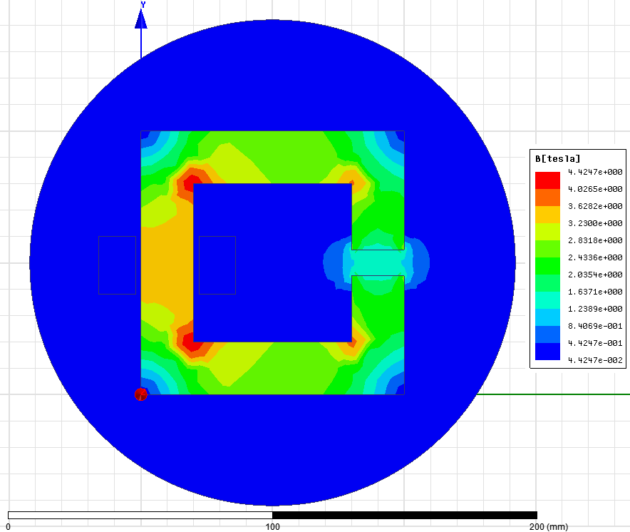
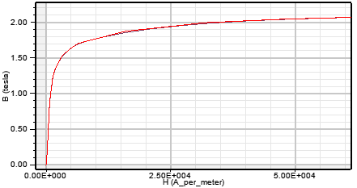
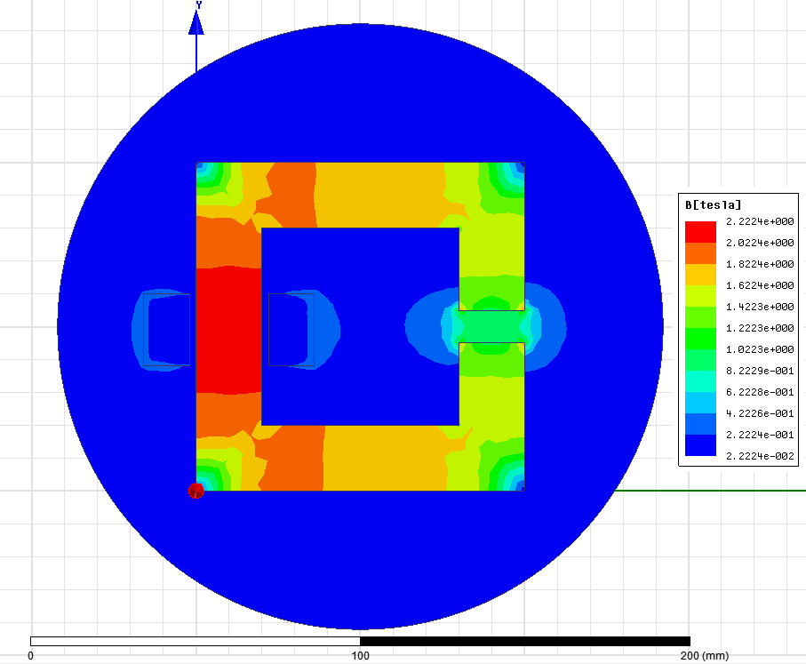
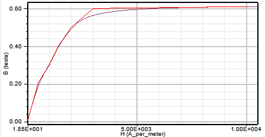
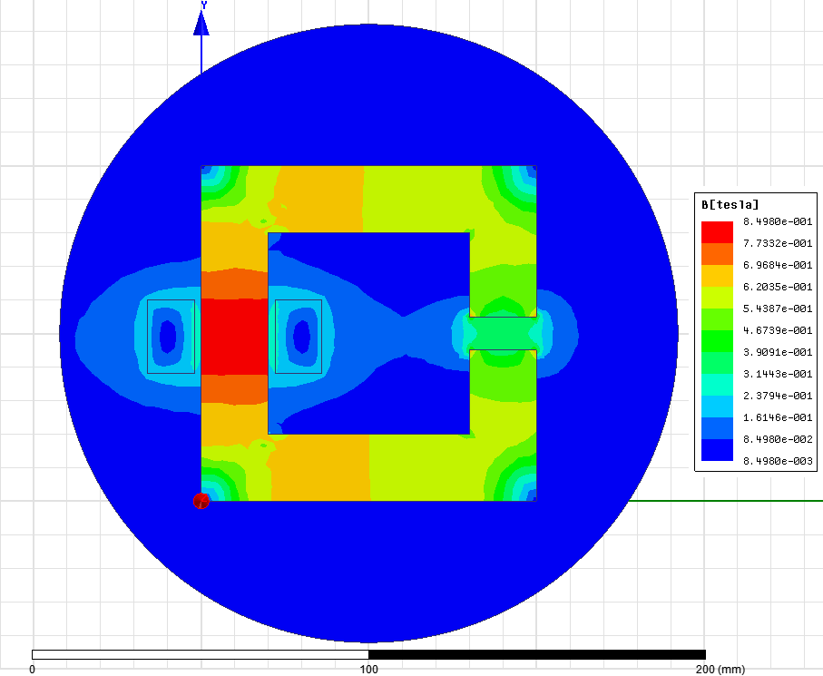
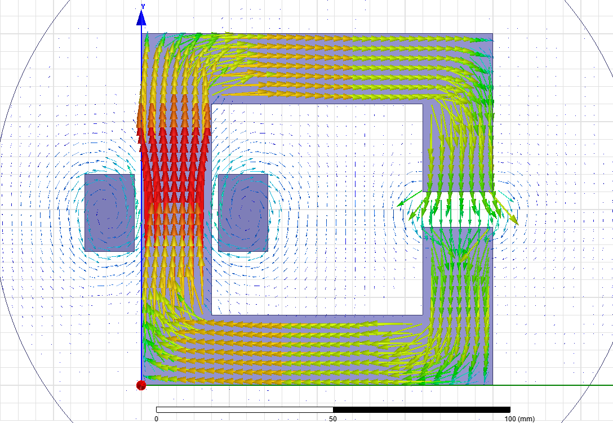
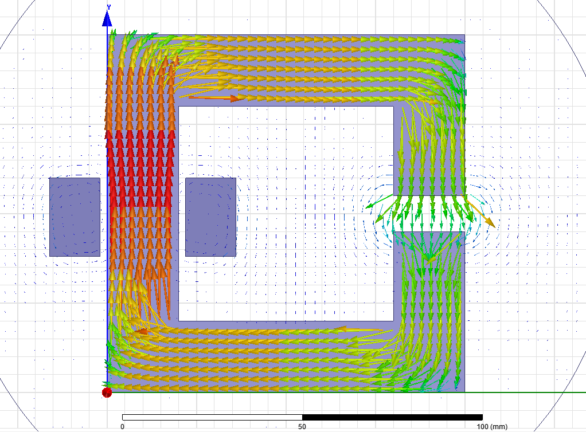
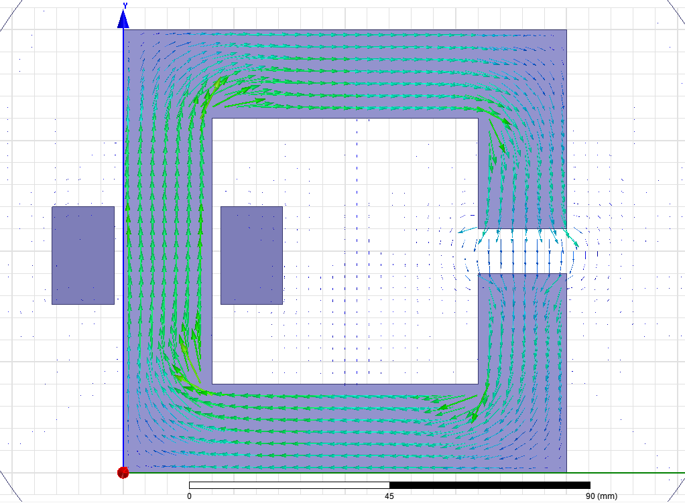

# Kaan Mutlu Motor Design Assigment-1 #

----------

**- Airgap flux density calculation:**

For an infinetly permeable core, here is the formula for airgap flux density:

F = N I = H lgap

B = µ H

Bgap = µ N I / lgap = (4 π 10^-7) x 100 x 120 x 10^2

Bgap = 1,508 T

----------

**- Inductance calculation:**

Here is the inductance formulation:

L = N^2 / R

R is the reluctance and can be calculated using the formula below:

R = lgap / (µ A)

R = 10^2 / ((4 π 10^-7) (2 10^2))

R = 397887,36 H^-1

L = (100^2)/(397887,36)

L = 25,13 mH

**- 2D model of C-core**

C-core is modelled by using Maxwell 16.0. As a core material customly selected one is prefered with relative permeability of 1000. Here is the flux density distribution over the c-core.

As it is seen from the figure, inner corners are the most intese areas. Their flux density values are over the saturation level that we face in real conditions. Outer corners' flux densities are lower than other areas as it is expected. Left bottom corner's circular mark is representing the z axis direction and it isn't related with flux density. Outer circular area is the selected boundary and its material is air.  

Air gap flux density is close to the calculated value and fringing effects are seen in the figure, too.

----------

Now core material is changed to a **steel with BH curve** below:

After a certain point linear region finishes and BH curve starts **saturation**. 2,2 T is the maximum flux density value for this material. Now let's see the new flux density of c-core for this material.

As it is expected maximum flux density point in the core is reduced to the saturation level of BH curve. Outer corners are still rare by means of flux density. Air gap's flux density is also decreased comparing to the previous case. Due to the saturation around exitation, some of the fluxes couldn't find path to themselves and leakages occured around the copper conductors.

----------

Now lets see what happens if core material is switched to the **iron with the BH curve** below (normally Maxwell doesn't have a BH curve for iron, therefore it is inserted manually).

Here is the flux density distribution of iron core:

Comparing to the first analysis all of the flux densities are reduced dramatically. Leakages' effective region is also increased.

----------

**- Flux density vectors**

Since the last analysis was for the iron material, its flux density is shown with vectors first.

In this figure, colors are still give us idea about flux densities' magnitudes. All leakage and fringing fluxes are so visible. 

Now lets see the vectors of steel with saturation:

Leakage to core flux density ratio is reduced with steel material. Fringing fluxes are still active. Iron's and steel's colors aren't representing the same Tesla, therefore they shouldn't be compared directly with colors.

Finally the material with relative permeability of 1000 is analized again to be able to see its flux density vectors:

In this case, we see that leakages are in the minimum level. There is still fringing fluxes. There isn't any saturation in the core. 

----------

**To be continued..**