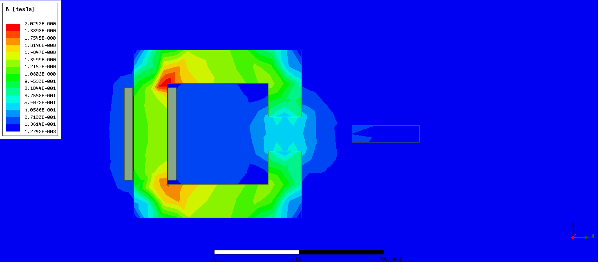
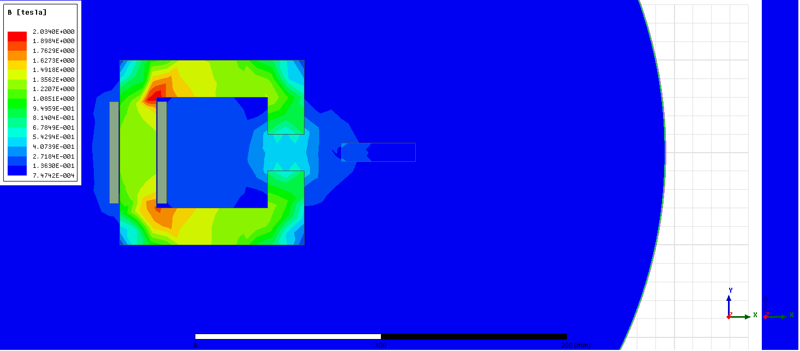
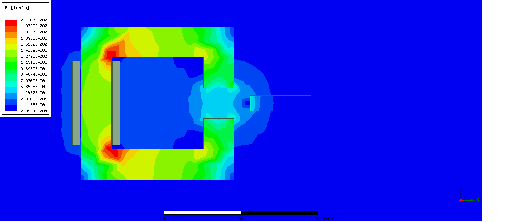
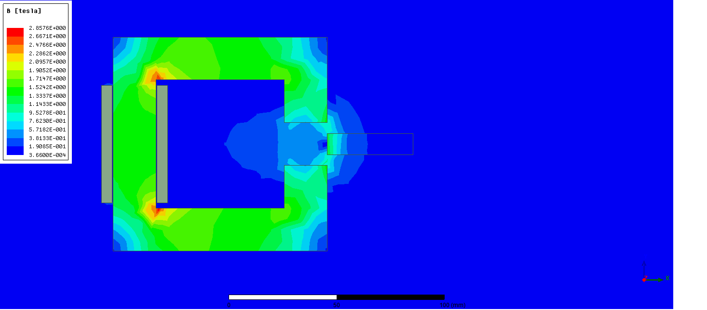
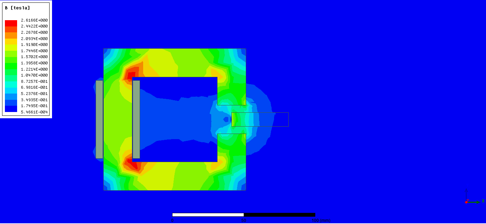
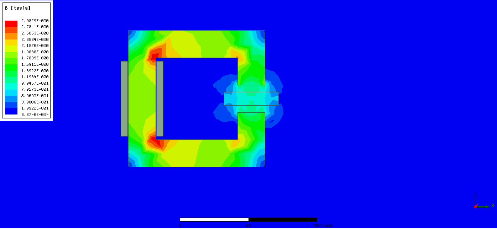
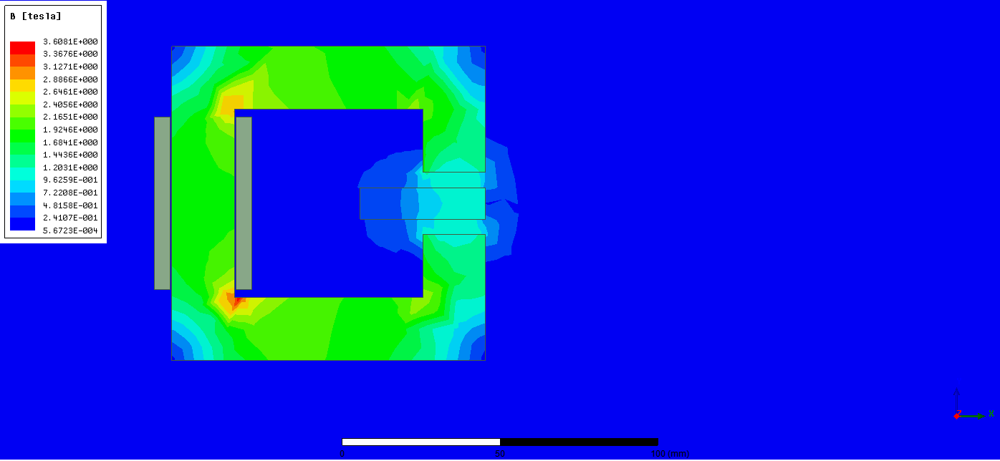
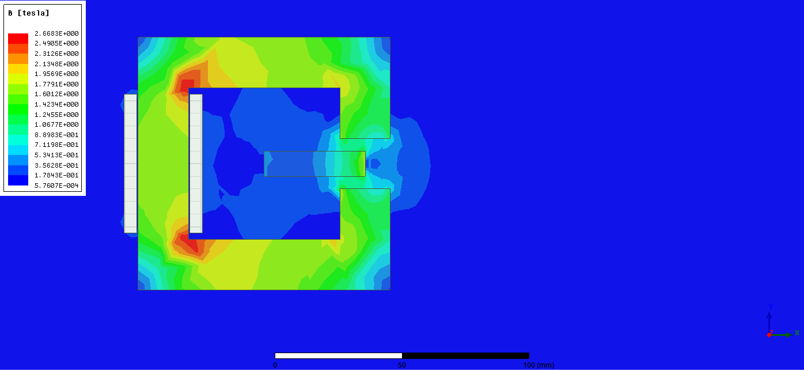
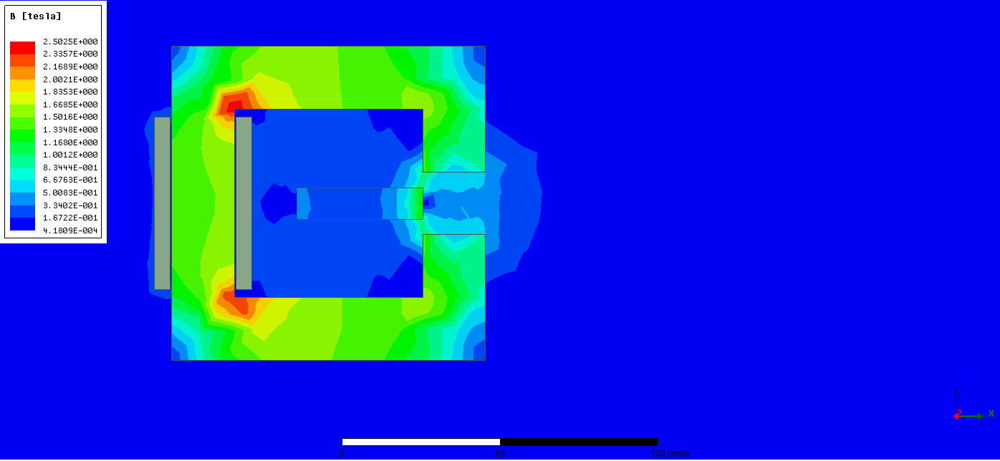

NI = ΦR  
Assuming infinite permeability  B = 0.5 T
ΦR = B * A * Lgap/(µ0 * A) = B * Lgap/µ0 ≈ 8000 = NI (chosen as 8500 )

choose N = 200 then  I = 40 A
then L = N * flux / i = N * B * A / i

### For the 1st position
Assuming ideal case
Reluctance is mainly due to the air gap i.e.

Reluctance = Lgap/(µ0 * A) = 0.02/(4 * pi * 10e-7 * 0.02 * 1)  = 79577 1/H

W = 0.5 * (NI)^2 /Reluctance = 454 joules (250 joules from the simulation)

From the simulation Magnitude of the Force applied is around 48 N 

flux_gap = A * B =0.02 * 1 * 0.5 = 0.01 Weber

L = 200 * 0.01 / 40 = 0.05 H

### For the 2nd position

Reluctance is mainly due to the air gap i.e.

Reluctance = Lgap/(µ0 * A) = 0.02/(4 * pi * 10e-7 * 0.02 * 1)  = 79577 1/H

W = 0.5 * (NI)^2 /Reluctance = 454 joules (251.9 joules from the simulation)

From the simulation Magnitude of the Force applied is around 113 N 

flux_gap = A * B = 0.02 * 1 * 0.54 = 0.0108 Weber

L = 200 * 0.0108 / 40 = 0.054 H

### For the 3rd position

Reluctance is mainly due to the air gap i.e.
Reluctance = Lgap/(µ0 * A) = 0.02/(4 * pi * 10e-7 * 0.02 * 1)  = 79577 1/H

W = 0.5 * (NI)^2 /Reluctance = 454 joules (255.2 joules from the simulation)

From the simulation Magnitude of the Force applied is around 412 N 

flux_gap = A * B = 0.02 * 1 * 0.56 = 0.0112 Weber

L = 200 * 0.0112 / 40 = 0.056 H

### For the 4th position

Reluctance is mainly due to the air gap i.e.

Reluctance = Lgap/(µ0 * A) = 0.02/(4 * pi * 10e-7 * 0.01 * 1)  = 79577 1/H

W = 0.5 * (NI)^2 /Reluctance = 454 joules (264.01 joules from the simulation)

From the simulation Magnitude of the Force applied is around 1713 N 

flux_gap = A * B = 0.02 * 1 * 0.60= 0.0120 Weber

L = 200 * 0.0120 / 40 = 0.060 H

### For the 5th position 

Reluctancegap1 = Lgap/(µ0 * A) = 0.02/(4 * pi * 10e-7 * 0.01 * 1)  = 159000 1/H

Reluctancegap2 = 0.01/(4 * pi * 10e-7 * 0.01 * 1) = 79577 1/H

total_reluctance = 53000 1/H

W = 0.5 * (NI)^2 /Reluctance = 681.6 joules (284.4 joules from the simulation)

From the simulation Magnitude of the Force applied is around 2052 N 

flux_gap = A * B = 0.02 * 1 * 1.4= 0.028 Weber

L = 200 * 0.028 / 40 = 0.14 H

### For the 6th position 

Reluctance = Lgap/(µ0 * A) = 0.01/(4 * pi * 10e-7 * 0.02 * 1)  = 39800 1/H

W = 0.5 * (NI)^2 /Reluctance = 907.66 joules (300 joules from the simulation)

From the simulation Magnitude of the Force applied is around 1270 N 

flux_gap = A * B = 0.02 * 1 * 1.7= 0.034 Weber

L = 200 * 0.034 / 40 = 0.17 H

### For the 7th position

Reluctance = Lgap/(µ0 * A) = 0.01/(4 * pi * 10e-7 * 0.02 * 1)  = 39800 1/H 

W = 0.5 * (NI)^2 /Reluctance =  907.66 joules (306 joules from the simulation)

From the simulation Magnitude of the Force applied is around 118 N 

flux_gap = A * B = 0.02 * 1 * 1.8= 0.036 Weber

L = 200 * 0.036 / 40 = 0.17 H

### For the 8th position

Reluctance = Lgap/(µ0 * A) = 0.01/(4 * pi * 10e-7 * 0.02 * 1)  = 39800 1/H

W = 0.5 * (NI)^2 /Reluctance = 907.66 joules (301 joules from the simulation)

From the simulation Magnitude of the Force applied is around 972 N 

flux_gap = A * B = 0.02 * 1 * 1.5= 0.03 Weber

L = 200 * 0.03 / 40 = 0.15 H

### For the 9th position

Reluctancegap1 = Lgap/(µ0 * A) = 0.02/(4 * pi * 10e-7 * 0.01 * 1)  = 159000 1/H

Reluctancegap2 = 0.01/(4 * pi * 10e-7 * 0.01 * 1) = 79577 1/H

total_reluctance = 53000 1/H

W = 0.5 * (NI)^2 /Reluctance = 681.6 joules (287.63 joules from the simulation)

From the simulation Magnitude of the Force applied is around 1912 N 

flux_gap = A * B = 0.02 * 1 * 1.2= 0.024 Weber

L = 200 * 0.024 / 40 = 0.12 H

### For the 10th position

Reluctance is mainly due to the air gap i.e.

Reluctance = Lgap/(µ0 * A) = 0.02/(4 * pi * 10e-7 * 0.02 * 1)  = 79577 1/H

W = 0.5 * (NI)^2 /Reluctance = 454 joules (268 joules from the simulation)

From the simulation Magnitude of the Force applied is around 1580 N 

flux_gap = A * B = 0.02 * 1 * 0.5= 0.01 Weber

L = 200 * 0.0125 / 40 = 0.05 H

