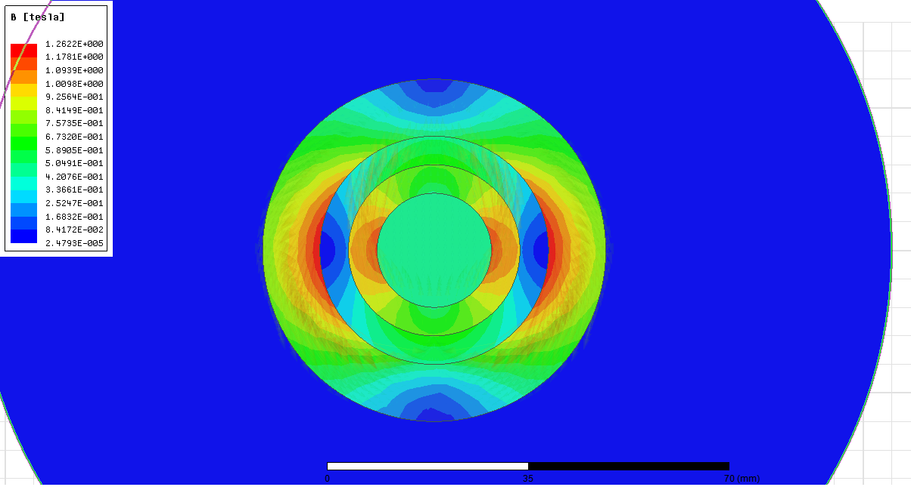
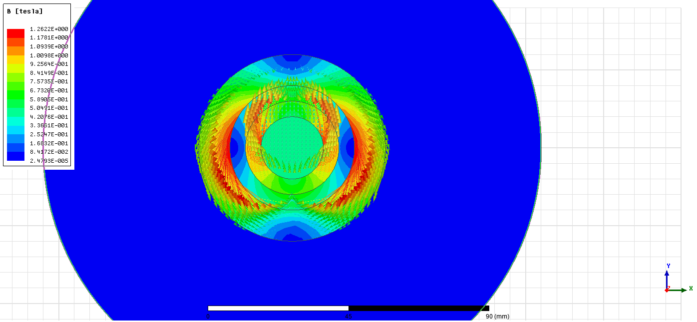
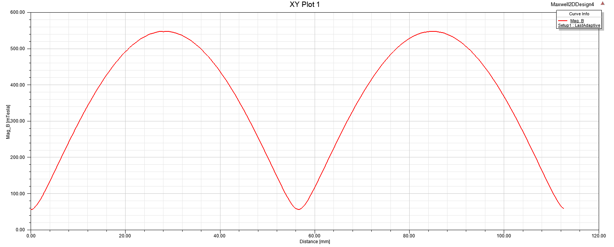
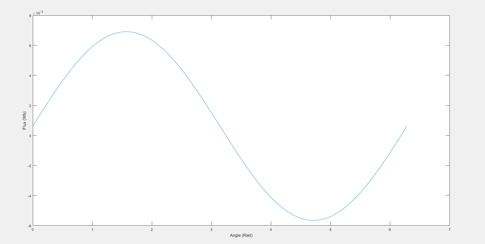
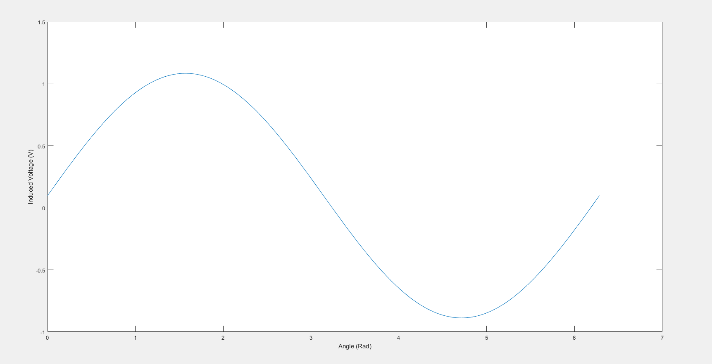

B = 0.05 + 0.5*sin(angle);

length = 0.1; %m

radius = 0.02;

area = 2*pi*radius*length;

gap = 0.005; 

u0 = 4*pi*10^-7;

reluctance = gap/(u0*area);

MMF = B * area * reluctance;

flux = B.*area;

Ea = 4.44 * 1* flux * 25 *sqrt(2);

