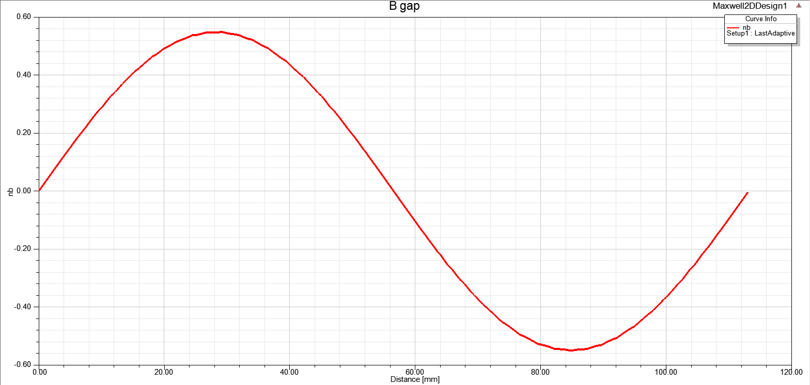

## Week 4 Assignment

As I have encountered an error, I am only able to provide B field distributions of diametrical and radially magnetized cases.

Total outer diameter: 80mm

I_coil=20A

### Diametrically Magnetized

### Radially Magnetized

error:

