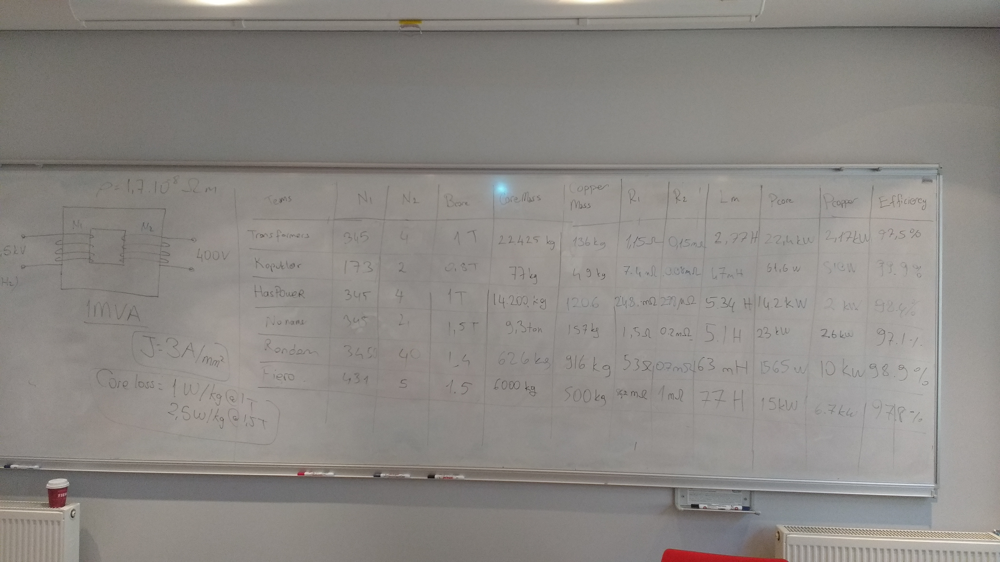

# Week 2- Analytical Design of a Transformer

This week you are required to repeat the analytical transformer design that we did in the lecture. However, you are required to make a more realistic approach, and I expect all of you to converge into more reasonable designs (i.e. neither 25 kg  nor 25.000 kg). Here's your last week's designs as a reminder:

You are free to use pen-paper (but please bring a copy next time), Matlab, Word etc. However, I think using a design sheet with Excel spreadsheet will be the easiest one to debug and modify.

## Transformer Specs:

- Input Voltage: 34.5 kV
- Output Voltage: 400 V
- Rating: 1 MVA

## Some constants

Here I give some constants that you may require, but please modify these if you need:

- Current Density: 3 A/mm2 (Can be increased with force cooling)
- Core loss: 1 W/kg @1 T, 2.5 W/kg @1.5 T (There are better laminations)
- Copper Density: 1.7 10^-8 Ohm.m (goes up with temperature)
- Fill Factor: 0.6
- Initial Permeability of the core: 1000 (can be modified)
- Leakage Inductance: 0.04 pu
- Core Material Cost: 3$/kg
- Copper Cost: 10$/kg

## Suggested Design Procedure

Although you can follow different steps, here's an example on which order you should design the transformer.

1. Choose operating flux density (As B increases core gets smaller, but losses increase)
2. Choose initial number of turns 
3. Calculate the required core cross section area for required induced voltages be careful while using Bmax to calculate inducted voltage rms)
4. Play with number of turns to get a reasonable core cross section area (Increasing number of turns reduces the size of the core, but copper mass and copper losses increase. There should be a balance in between).
5. Decide on the core dimensions. The window of the core should be wide enough to fit both primary and secondary coils.
6. Decide on the coil dimensions, using the current density (Note that, secondary coil will be much thicker. You can freely choose cable dimensions, but choosing one of standard [AWG](https://en.0wikipedia.org/index.php?q=aHR0cHM6Ly9lbi53aWtpcGVkaWEub3JnL3dpa2kvQW1lcmljYW5fd2lyZV9nYXVnZQ) cables is a better option).
8. Modify core dimensions, if it turns out to small or too big. Calculate core mass and core losses.
9. Calculate the length and resistance of the primary and secondary winding.
10. Calculate inductances. You can estimate the Lm as the inductance seen from the first winding (i.e. N1^2/Rcore). You can assume the total leakage inductance is 0.04 pu. Calculate the actual value.
11. Calculate efficiency and other parameters. Remember 1MVA is the value you need to give from the output.
12. Go back to (1) and iterate again if something doesn't seem right.

## Commercial Products

Here are a few links to commercial products just to give you an idea. Please note that, all these products are **three phase** transformers. Please add other links that you find useful.

- [Dry Type Transformer](http://www.weiku.com/products/10469472/SGH10_dry_type_transformer.html)
- [Alibaba transformers](https://www.alibaba.com/showroom/1-mva-transformer.html)
- [1 MVA Specs](http://www.transformerchina.com/sell-2468065-dry-type-transformer-10kv-100kva-dyn11-resin-insulation-tapping-range-mva-power.html)
