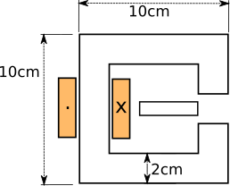

# Week 3- Electromechanical Energy Conversion

## Topics Covered:

- Principles of electromechanical energy conversion
- Maxwell Pressure
- Force and torque generation in magnetic circuits

## Suggested Readings

If you think you need to have some theory review, please have a look at the following presentations from the EE361 course:

- [Electromechanical Energy Conversion](http://keysan.me/presentations/ee361_electromechanical_conversion.html)
- [Magnetic Stress, Rotational Motion](http://keysan.me/presentations/ee361_virtual_work.html)
- [Multiply Excited Systems](http://keysan.me/presentations/ee361_multiply_excited.html)

## Assignment:

At this week's assignment, you are required to simulate the magnetic forces in a iron plunger as shown below:

Notes:

- The number of turns and current is not given. Choose these parameters such that to get around 0.5 T in the airgap. You can assume the current stays constant.

- Assume the C-core and plunger have relative permeability of 1000 and linear (Bonus: you can also get the non-linear properties as you used in Week 1 simulations)

- The plunger is vertically positioned at the center of the airgap (i.e. 0.5mm gap each side), and only move in horizontal direction.

You need to run 10 FEA (2D preferred) simulations from the inital position shown in the figure above to the final position shown in the figure below at 1 cm horizontal increments.

For every position:

- Calculate total magnetic energy stored in the system

- Calculate the horizontal force acting on the plunge

- Calculate the inductance at each position

- Show flux density vector distribution

## Deliverables:

- I expect each student to prepare his/her own assignments including the analytical calculations

- Graphs showing the stored energy, force, inductance etc vs positon 

- A set of figures (.png) for flux density distribution

- BONUS: A realistic animation of plunger moving horizontally

- A document (preberably in .md format, but .doc is also ok) for you comments etc.

## Some Hints:

- Understand the analytical model before building the FEA model.

- When constructing the FEA model, go step-by-step. First try the simplest case and check if it is working as intended, if it works then make it more realistic.

- Don't forget to choose a reasonable solution space (i.e. air around the core), and don't forget to assign air material properties.

- Put your files in a separate folder with your name in Week3-Assignments folder (you should have write access to the Github repo)

- Do NOT put your FEA files or any big files to the course repo (You are free to create your own repos for this purpose).

- If you didn't put effort on any of these above, there is almost no benefit you can get from this course. Therefore, I advise you not to waste your time on Friday as well.

## Still Have Questions?

- Please don't hesitate to ask for help. You are encouraged to work together, but I expect everyone to prepare their own assignments.

- If you have a public question, please [open an issue](https://github.com/odtu/motor-design/issues/new) in this repo, and I will try to answer it asap.

