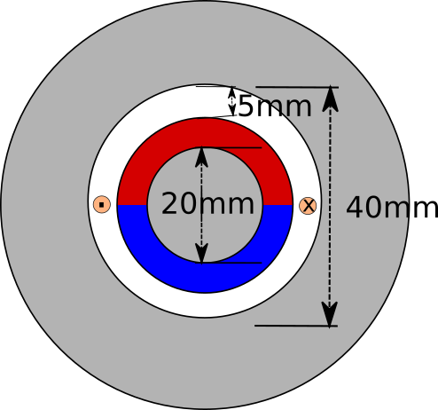

# Week 4- Induced Voltage

## Topics Covered:

- Induced Voltage in air-cored PM motors
- Magnetization direction of round PMs
- Symmetry in FEA (to be contibued)

## Assignment:

At this week's assignment, you are required to model an air-cored radial flux PM machine as shown below:

Notes:

- You are required to choose the outer diameter. Just try to find a reasonable value to prevent saturation in the core material, which you will choose as well.

- The axial length of the machine is 100 mm.

- Assume the remanence flux density of the magnets are 1.2 T.

- Assume the number of turns is 1.

The magnets can be magnetized in [many different ways](http://www.macmillmagnet.com/imges/Glossary_clip_image001.gif)

In this assignment you are required to compare to different magnetizations:

- radially oriented magnetization
- diametrical magnetization

For each magnetization directions:

- Plot the magnetic flux vectors, and magnetic flux magnitude (rotor core can saturate, don't worry)

- Plot the radial flux density (Brad) in the center of the airgap from 0 to 360 degrees in a graph, and export it (to excel or Matlab etc)

- Plot the flux linkage in the coil as a function of theta.

- Plot the induced voltage magnitude as a function of time (when the rotor is rotating at 1500 rpm).

- Calculate the inductance of the coil.

- BONUS: Implement the half-symmetry and quarter symmetry, and show you can get the same flux density distribution.

## Some Hints:

- Understand the analytical model before building the FEA model.

- When constructing the FEA model, go step-by-step. First try the simplest case and check if it is working as intended, if it works then make it more realistic.

- Try to use a fine mesh for a higher simulation accuracy. In particular, use finer mesh in the airgap.

## Still Have Questions?

- Please don't hesitate to ask for help. You are encouraged to work together, but I expect everyone to prepare their own assignments.

- If you have a public question, please [open an issue](https://github.com/odtu/motor-design/issues/new) in this repo, and I will try to answer it asap.

