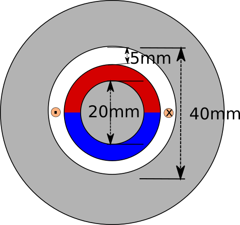

# Week 5- Winding Design

## Topics Covered:

- Winding design in air-cored PM motors
- Winding factors (distribution-pitch factor)
- Standard cable sizes
- Electrical-Magnetic Loading

## Assignment:

This week, you are required to design the winding for the PM motor we covered last week.

Notes:

- If there are some points not clear from last week, please go and review these.

- We will use a sinusoidal B distribution throughout the airgap. As everyone, found slightly different numbers, we will assume a sinusoidal magnetic flux density distribution with a peak value of 0.6 T.

- Recalculate the flux linkage for a full-pitched coil. 

- Assume we have to leave 1 mm for the mechanical air-gap (i.e. the winding thickness will be 4 mm)

- Decide on number of turns, number of coils such that you will obtain 24V induced voltage at 1500 rpm. Remember, you need to design 3-phase winding arrangement.

- Decide on how many coils will be connected in series and in parallel.

- When calculating the geometry, assume the fill factor is 0.7.

- You are required to use  [standard AWG round](http://www.wikizero.org/index.php?q=aHR0cHM6Ly9lbi53aWtpcGVkaWEub3JnL3dpa2kvQW1lcmljYW5fd2lyZV9nYXVnZQ) cables.

- By assuming a current density of 4 A/mm2, calculate the rated phase current and rated power.

- Calculate the phase winding resistance, and copper losses at the rated current.

- You are free to use Matlab, Excel etc, you are also free to make your calculations on paper and bring it with you.

- Please review [EE362](http://keysan.me/ee362/), and [EE564](http://keysan.me/ee564/) notes if you have problems on winding arrangements.

## Still Have Questions?

- Please don't hesitate to ask for help. You are encouraged to work together, but I expect everyone to prepare their own assignments.

- If you have a public question, please [open an issue](https://github.com/odtu/motor-design/issues/new) in this repo, and I will try to answer it asap.

